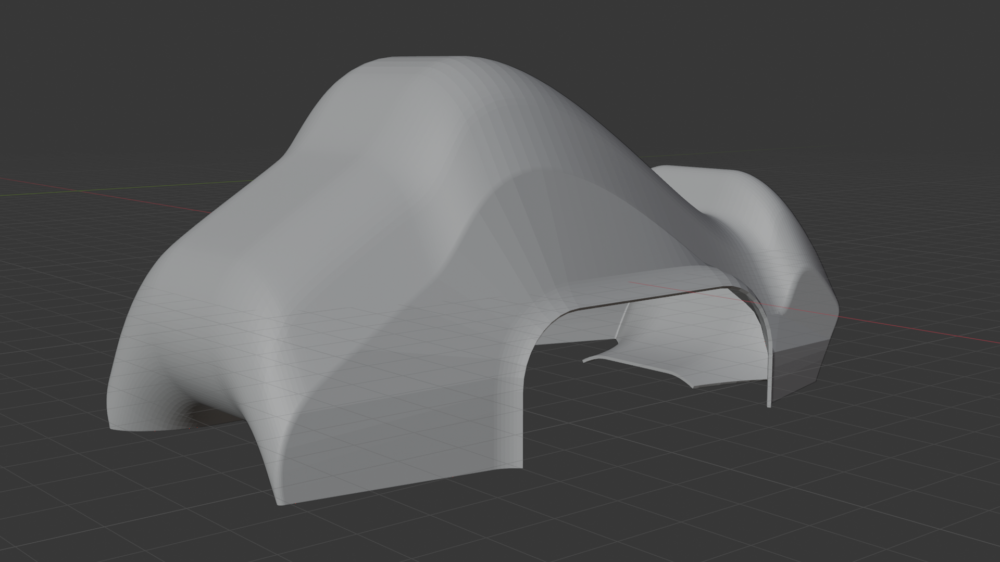

# SF-27 — Site Web du Projet Autonova Industries

Site web statique présentant le projet de voiture robot autonome Arduino,
réalisé par les élèves de 1ère Sciences de l'Ingénieur.

---

## 📁 Structure des fichiers

```
sf27-site/
├── index.html          ← Page principale (site entier)
├── css/
│   └── style.css       ← Toutes les règles de style
├── js/
│   └── main.js         ← Navigation et interactions
├── assets/             ← Dossier pour tes images et fichiers
│   └── (tes photos, rendus Blender, schémas...)
└── README.md           ← Ce fichier
```

---

## 🚀 Héberger le site sur GitHub Pages (gratuit)

### Étape 1 — Créer un compte GitHub
Rends-toi sur [github.com](https://github.com) et crée un compte gratuit.

### Étape 2 — Créer un dépôt
1. Clique sur le bouton vert **"New"** (ou **"+ New repository"**).
2. Donne-lui un nom, par exemple : `sf27-autonova`
3. Sélectionne **"Public"**
4. Clique **"Create repository"**

### Étape 3 — Uploader les fichiers
**Option A — Via l'interface web GitHub (plus simple) :**
1. Dans ton dépôt, clique **"uploading an existing file"**
2. Glisse-dépose TOUS les fichiers et dossiers du projet
3. Clique **"Commit changes"**

**Option B — Via Git en ligne de commande :**
```bash
cd sf27-site
git init
git add .
git commit -m "Premier commit — site SF-27"
git remote add origin https://github.com/TON-NOM/sf27-autonova.git
git push -u origin main
```

### Étape 4 — Activer GitHub Pages
1. Dans ton dépôt, va dans **Settings** → **Pages** (menu de gauche)
2. Sous "Source", sélectionne **"Deploy from a branch"**
3. Choisis la branche **"main"** et le dossier **"/ (root)"**
4. Clique **"Save"**

### Étape 5 — Accéder à ton site
Après 1-2 minutes, ton site sera accessible à l'adresse :
```
https://TON-NOM.github.io/sf27-autonova/
```

---

## 🖼️ Ajouter tes propres images

### Photos du robot physique
1. Copie tes photos dans le dossier `assets/`
2. Nomme-les clairement : `robot-1.jpg`, `robot-2.jpg`, etc.
3. Dans `index.html`, trouve les blocs avec la classe `gallery-placeholder`
4. Remplace leur contenu par :
```html

```

### Rendus Blender
1. Exporte depuis Blender : **File → Render → Render Image** puis **Image → Save As**
2. Copie le fichier PNG dans `assets/` (ex: `blender-vue-avant.png`)
3. Remplace le placeholder correspondant dans la Galerie et dans l'onglet "Modélisation 3D"

---

## ✏️ Personnaliser le contenu

### Changer les noms des professeurs
Dans `index.html`, cherche (Ctrl+F) :
```
✎ Complète ce bloc avec le nom de ton professeur
```
Et remplace les blocs par les vraies informations.

### Changer les noms des membres de l'équipe
Cherche les initiales **TC**, **PG**, **CD** dans `index.html`
et les balises `team-name` / `team-role` / `team-desc` correspondantes.

### Modifier les couleurs
Dans `css/style.css`, tout en haut, modifie les variables CSS :
```css
--accent-o: #FF5500;    /* Orange — couleur principale */
--accent-b: #00C8FF;    /* Bleu cyan — couleur secondaire */
--bg-base:  #090C14;    /* Fond très sombre */
```

### Ajouter une vidéo dans la Galerie
Dans la section galerie de `index.html`, ajoute un bloc :
```html
<div class="gallery-item" style="height:200px;">
  <video controls style="width:100%;height:100%;object-fit:cover;">
    <source src="assets/ma-video.mp4" type="video/mp4">
  </video>
  <div class="gallery-label">Nom de la vidéo</div>
</div>
```

---

## 💡 Conseils pour l'avenir

- **Mettre à jour régulièrement** : modifie le fichier HTML directement sur GitHub en cliquant l'icône crayon ✏️ sur le fichier.
- **Sauvegarder** : GitHub garde l'historique de toutes tes modifications. Tu peux revenir en arrière à tout moment.
- **Tester en local** : double-clique sur `index.html` dans ton gestionnaire de fichiers pour l'ouvrir dans un navigateur, sans avoir besoin de connexion internet.
- **Format des images** : préfère le format JPG pour les photos (plus léger) et PNG pour les rendus 3D (meilleure qualité).

---

## 🛠️ Technologies utilisées

| Technologie | Version | Usage |
|-------------|---------|-------|
| HTML5 | — | Structure du site |
| CSS3 | — | Mise en page et animations |
| JavaScript (Vanilla) | ES6+ | Navigation SPA, galerie |
| Google Fonts | — | Orbitron, Rajdhani, JetBrains Mono, Nunito |

Aucune dépendance externe autre que les polices Google Fonts.
Le site fonctionne entièrement hors-ligne si les polices sont installées localement.

---

## 📞 Besoin d'aide ?

En cas de problème pour héberger le site, consulte la documentation officielle de GitHub Pages :
[docs.github.com/fr/pages](https://docs.github.com/fr/pages)

---

*SF-27 · Autonova Industries · 1ère Sciences de l'Ingénieur · 2024–2025*
